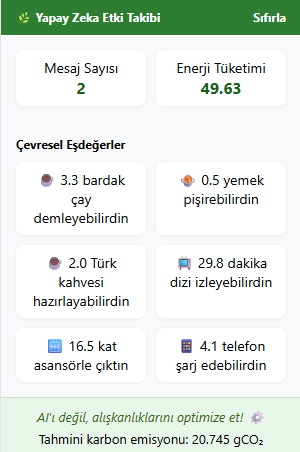
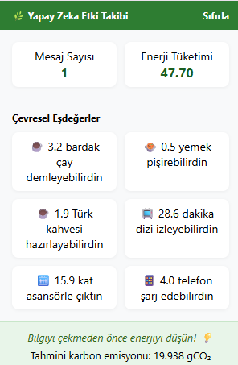

# 🌿 Yapay Zekâ Enerji Takibi - Chrome Uzantısı

<h3 align="center">Ekran Görüntüsü 2</h3>

  

<h3 align="center">Ekran Görüntüsü 1</h3>

  

Bu uzantı, ChatGPT üzerinde yaptığınız sorguların enerji tüketimini, karbon salımını ve çevresel etkilerini tahmin eder. 🌍⚡Amacı, büyük dil modellerinin sürdürülebilirliğine dikkat çekmek ve kullanıcıları bilinçlendirmektir.

## 📸 Özellikler

- 🔢 Gerçek zamanlı enerji tüketimi: Gönderdiğiniz her prompt için enerji tüketimi (Wh) ve karbon salımı (gCO₂) anında hesaplanır.

- ☁️ Karbon ayak izi: Enerji kullanımınıza göre güncel karbon salımı gösterilir.

- 🍵 Çevresel eşdeğerler: Harcadığınız enerji; çay demlemek, Türk kahvesi yapmak, dizi izlemek gibi kültürel örneklerle görselleştirilir.

- 💬 Mesaj sayacı: Toplam kaç etkileşimde bulunduğunuz kayıt altına alınır.

- 🔄 Günlük sıfırlama: Enerji verileri her gün Türkiye saatiyle gece 00:00’da otomatik olarak sıfırlanır.

- 🔁 Sıfırla butonu: Dilerseniz verileri manuel olarak da sıfırlayabilirsiniz.

## 🧠 Hesaplama Yöntemi
 **EcoLogits:** Literatüre dayalı GPT-4o hesaplaması (Wh/token)
